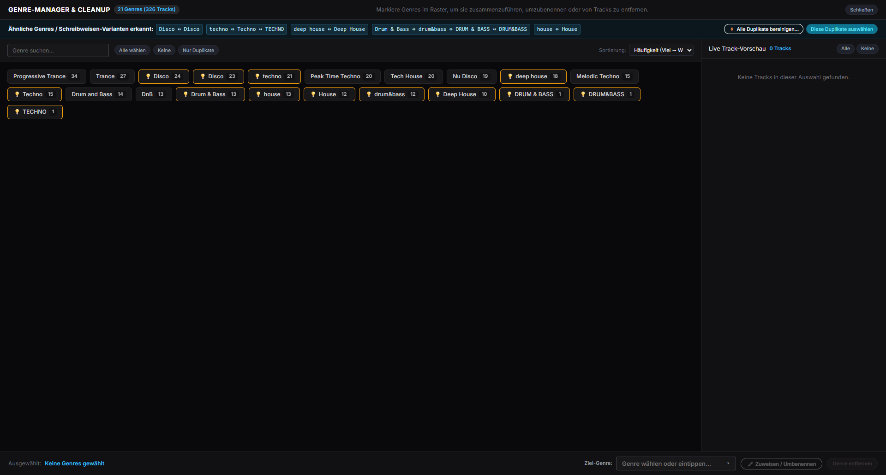
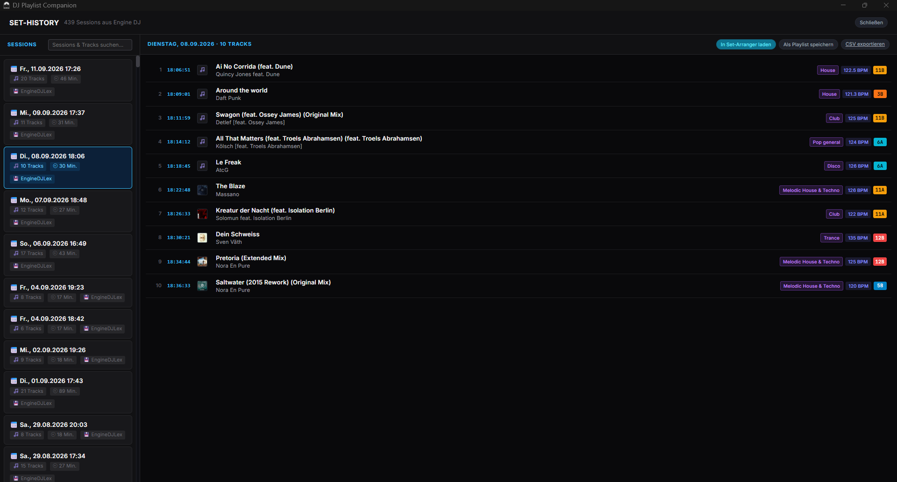
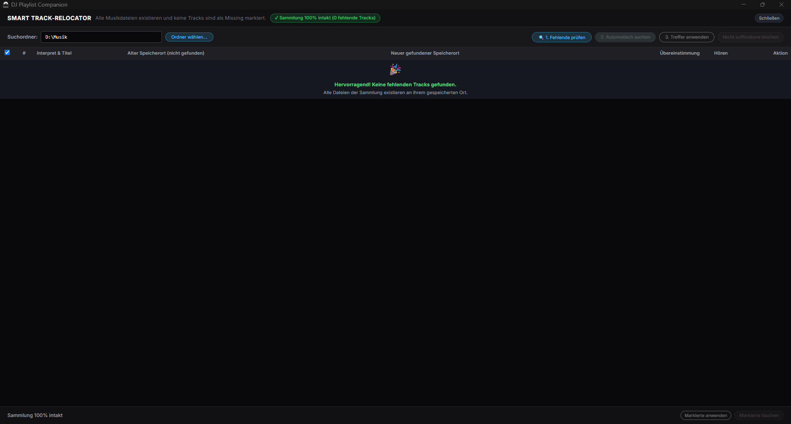
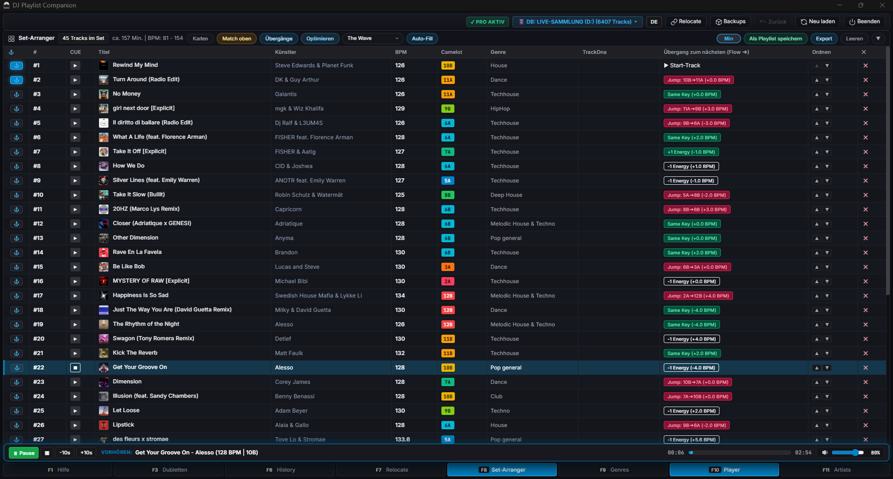

  

# 🎧 DJ Playlist Companion

## Take control of your Engine DJ library.

**Clean your library. Fix missing tracks. Build better sets.**

Beta-Testversion für **Windows 10 & 11** · **Engine DJ** · **Denon DJ**

[⬇️ **DOWNLOAD BETA v1.0.0-beta.3**](https://github.com/tintronik/DJ-Playlist-Companion-Beta/releases/download/v1.0.0-beta.3/DJ_Playlist_Companion_Demo_Setup.exe)

---

## 🎯 What is DJ Playlist Companion?

**DJ Playlist Companion** is a powerful Windows desktop tool for DJs who use **Engine DJ** and want more control over their music library and set preparation.

It helps you:

- clean and organize your Engine DJ library
- find and remove duplicate tracks
- repair missing or moved track locations
- manage genres and artists
- analyze and improve your set flow
- review your set history
- preview tracks and cue points
- create backups before changing your Engine DJ database

It works **locally on your Windows PC** and is designed for DJs with larger libraries who want to spend less time managing files and more time preparing great sets.

---

# 🚀 Key Features

### 🌊 F8 — Set Arranger

Build better sets with intelligent tools for track flow and energy management.

- **The Wave**
- **Progressive Ramp**
- **Peak-Time**
- BPM flow
- Key flow
- visual set planning

Perfect for preparing a set before going to the club, festival or next gig.

---

### 🧹 F3 — Duplicate Cleaner

Find duplicate tracks in your Engine DJ collection.

Detects common duplicate situations such as:

- identical track titles
- naming variations
- multiple copies of the same track

Clean up your library with a simple workflow instead of manually searching through thousands of tracks.

---

### 🎵 F9 — Genre Manager

Keep your genres consistent and usable.

- identify inconsistent genre information
- normalize genre names
- clean up genre chaos
- improve filtering and playlist organization

---

### 👤 F11 — Artist Manager

Improve artist information across your library.

- find inconsistent artist entries
- clean up artist names
- identify variations
- keep your collection structured

---

### 📍 F7 — Smart Track Relocator

Moved or missing files are one of the most frustrating problems in a DJ library.

**Smart Track Relocator** helps you find tracks whose file paths have changed.

Useful when:

- you moved music to another folder
- you reorganized your music drive
- paths changed after migrating a library
- Engine DJ reports missing tracks

---

### 📚 F6 — Set History

Keep track of what you played.

Review your previous sets and use your history to:

- remember successful combinations
- avoid repeating tracks too often
- analyze previous performances
- prepare future sets

---

### ▶️ F10 — CUE Player

Preview your tracks directly inside DJ Playlist Companion.

Use the integrated player to quickly inspect tracks while working on your library and set preparation.

---

### 💾 Automatic Backups

Your Engine DJ database is important.

DJ Playlist Companion creates backups before permanent database changes so you can work more safely.

**Always keep your own backup as well**, especially during beta testing.

---

# 📸 Screenshots

## Start

## Set Arranger

## Genre Manager

## Set History

## Track Relocator

## CUE Player

---

# 🧪 Beta Test

DJ Playlist Companion is currently available as a **120-day beta test**.

During the beta:

- all features are available
- there are no track-count limitations
- you can use the complete application
- your feedback directly helps shape the product

After the beta period expires, the application switches to **read-only mode**.

You can still:

- view your collection
- plan sets
- analyze your music
- use backups
- work with the application without modifying the Engine DJ database

Saving changes to the Engine DJ database after the beta requires a **Pro license**.

**Nothing is automatically deleted when the beta expires.**

---

# ⬇️ Download

## Windows 10 / 11 — 64-bit

**Latest beta:** `v1.0.0-beta.3`

### Direct Download

[⬇️ **Download DJ Playlist Companion Beta**](https://github.com/tintronik/DJ-Playlist-Companion-Beta/releases/download/v1.0.0-beta.3/DJ_Playlist_Companion_Demo_Setup.exe)

Installer:

`DJ_Playlist_Companion_Demo_Setup.exe`

The installer does **not require administrator rights**.

---

# 🖥️ System Requirements

### Operating System

- Windows 10 64-bit
- Windows 11 64-bit

### Engine DJ

- Engine DJ 3.x
- Engine DJ 4.x
- Engine DJ 5.0+

### No additional runtime required

You do **not** need to install:

- Python
- .NET
- additional development tools

---

# 📦 Installation

1. Download the latest beta installer.
2. Start `DJ_Playlist_Companion_Demo_Setup.exe`.
3. Follow the installation wizard.
4. Start DJ Playlist Companion.
5. The application searches for your Engine DJ database automatically.

The default installation location is:

`%LOCALAPPDATA%\Programs\DJ Playlist Companion`

DJ Playlist Companion looks for the Engine DJ database:

`Engine Library\Database2\m.db`

The application can also work with multiple Engine DJ libraries, including libraries located on:

- your PC
- USB drives
- external SSDs

For detailed installation information, see:

[📖 Installation Guide](docs/INSTALLATION.md)

---

# ⚠️ Important: Engine DJ Database

DJ Playlist Companion works directly with your **Engine DJ database** when changes are saved.

Therefore:

### Before making database changes

- close Engine DJ
- make sure your music drives are connected
- keep a backup of your Engine DJ library
- during beta testing, test carefully before using the application on your main library

DJ Playlist Companion also creates automatic backups before permanent changes.

---

# 🔐 Privacy

DJ Playlist Companion is designed as a **local-first application**.

### Your library data stays local.

There is:

- no usage profiling
- no tracking of your DJ activity
- no telemetry for your music library
- no cloud upload of your Engine DJ database

The application only requires an internet connection when a **Pro license key** is activated through the licensing provider.

---

# 🛡️ Windows SmartScreen

Because the beta installer is currently **not digitally signed**, Windows SmartScreen may display a warning when you start the installer.

This does not mean that the installer is malicious.

If you downloaded the installer from the official GitHub release, you can review the release information and verify the file checksum before continuing.

SHA-256 checksums are provided in:

[release/SHA256SUMS.txt](release/SHA256SUMS.txt)

---

# 📖 Documentation

- [Installation Guide](docs/INSTALLATION.md)
- [Beta Test Guide](BETA_TESTANLEITUNG.md)
- [Changelog](CHANGELOG.md)
- [Release Checklist (German)](release/RELEASE_CHECKLIST.md)
- [Privacy Policy](DATENSCHUTZ.md)
- [EULA](EULA.md)
- [License](LICENSE.md)

---

# 💬 Feedback & Bug Reports

This is a beta version, and your feedback is extremely valuable.

If you find a bug, have an idea or want to suggest an improvement, please open an issue on GitHub.

### Please include:

- Windows version
- Engine DJ version
- DJ Playlist Companion version
- what you were trying to do
- what happened
- screenshots if useful
- relevant log information if available

👉 [Open a GitHub Issue](https://github.com/tintronik/DJ-Playlist-Companion-Beta/issues)

You can also use the repository discussions for questions and general feedback.

👉 [GitHub Discussions](https://github.com/tintronik/DJ-Playlist-Companion-Beta/discussions)

---

# 🗺️ Roadmap

DJ Playlist Companion is actively being developed.

The goal is to build a professional toolkit for **Engine DJ library management and set preparation**.

Future development will be guided strongly by feedback from DJs using the application.

If you have a feature request, please open an issue and describe your workflow and use case.

---

# 🎧 Who is it for?

DJ Playlist Companion is especially useful for:

- DJs with large Engine DJ libraries
- club DJs
- mobile DJs
- bedroom DJs
- DJs preparing longer sets
- DJs who regularly reorganize their music
- DJs who have problems with duplicate or missing tracks
- DJs who want better control over their Engine DJ database

If you use **Engine DJ** and your music library has grown into something difficult to manage, DJ Playlist Companion is built for you.

---

# 🔄 Engine DJ Workflow

A typical workflow looks like this:

**1. Import / manage music in Engine DJ**

↓

**2. Open DJ Playlist Companion**

↓

**3. Clean and organize your library**

↓

**4. Relocate missing tracks**

↓

**5. Manage artists and genres**

↓

**6. Analyze and arrange your set**

↓

**7. Preview tracks and cue points**

↓

**8. Save changes back to your Engine DJ database**

↓

**9. Back up your library**

---

# 📌 Current Limitations

The current beta has a few important limitations:

- Windows 10/11 64-bit only
- Engine DJ only
- the beta installer is currently unsigned
- Engine DJ should be closed while DJ Playlist Companion makes database changes
- Pro purchasing is not yet active in the beta

---

# ⚖️ Disclaimer

DJ Playlist Companion is an independent third-party software project.

It is **not affiliated with, sponsored by, endorsed by or officially connected to inMusic Brands, Denon DJ or Engine DJ**.

Engine DJ and related trademarks are property of their respective owners.

Use database modification features responsibly and maintain your own backups.

---

# 📄 License

See [LICENSE.md](LICENSE.md) for licensing information.

The application is provided for beta testing purposes under the terms of the included EULA.

---

# ⭐ Support the Project

If DJ Playlist Companion helps you manage your Engine DJ library, please consider:

⭐ starring the GitHub repository  
🐛 reporting bugs  
💡 suggesting features  
💬 sharing your feedback with other DJs

Every beta tester helps make the application better.

---

### 🎧 DJ Playlist Companion

**Clean your library. Fix missing tracks. Build better sets.**

Made for DJs who use Engine DJ.

[⬇️ Download the Beta](https://github.com/tintronik/DJ-Playlist-Companion-Beta/releases/download/v1.0.0-beta.3/DJ_Playlist_Companion_Demo_Setup.exe)

