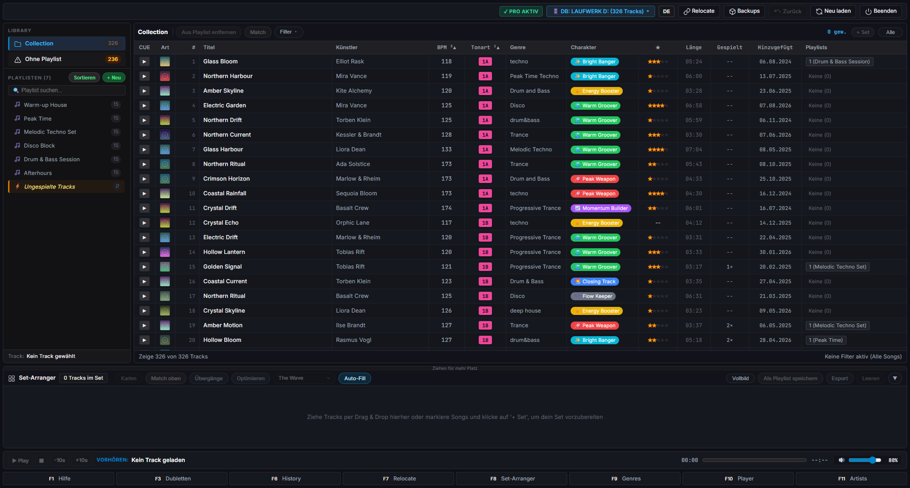
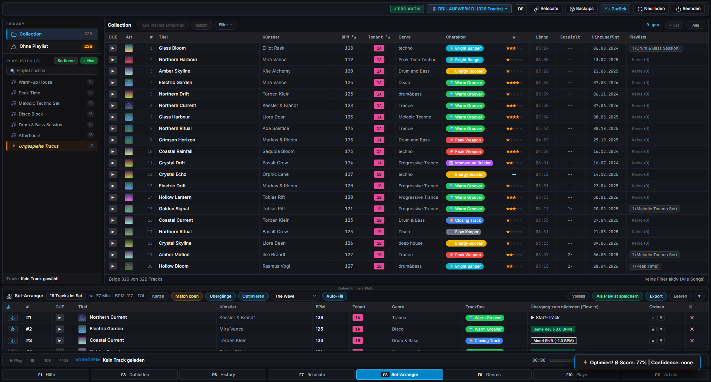

# 🎧 DJ Playlist Companion

## Take control of your Engine DJ library.

**Clean your library. Fix missing tracks. Build better sets.**

DJ Playlist Companion is a Windows application built specifically for **Denon DJ / Engine DJ users** who want to spend less time managing their music library and more time preparing and playing great sets.

> 🧪 **FREE 120-DAY BETA — All features unlocked. No track limits.**

[⬇️ Download the latest Beta](../../releases) · [🐞 Report a bug](../../issues/new) · [💬 Join the discussion](../../discussions)

---

## Why DJ Playlist Companion?

The bigger your DJ library gets, the harder it becomes to keep everything organized.

Duplicate tracks.
Inconsistent artist names.
Messy genres.
Missing files.
Thousands of tracks to search through before a gig.

**DJ Playlist Companion brings powerful library management and set preparation tools together in one application.**

### Your music library should work for you — not against you.

---

# 🚀 What can you do with DJ Playlist Companion?

## 🎵 Build better DJ sets

### Set Arranger · `F8`

Turn a collection of tracks into a structured, playable DJ set.

Choose between different approaches:

* 🌊 **The Wave**
* 📈 **Progressive Ramp**
* 🔥 **Peak-Time**

Analyze your tracks and optimize:

* BPM flow
* Key flow
* Energy progression
* Set structure

**From a collection of tracks to a set you can actually play.**

---

## 🧹 Clean up your music library

### Duplicate Cleaner · `F3`

Find duplicate tracks and common naming variations.

For example:

```text
Track Title.mp3
Track Title (1).mp3
Track Title [Remastered].mp3
```

DJ Playlist Companion can identify duplicates and help you clean them up with a simple workflow.

**Less clutter. More control.**

---

## 🎚️ Standardize your genres

### Genre Manager · `F9`

Keep your genre names consistent.

For example:

```text
DnB
D&B
Drum n Bass
Drum & Bass
```

can be standardized to:

```text
Drum & Bass
```

A consistent library makes searching, filtering and playlist preparation much easier.

---

## 👤 Clean up artist names

### Artist Manager · `F11`

Find and correct inconsistent artist names.

Quickly navigate your artist library using A–Z navigation and correct naming variations.

For example:

```text
tiesto
Tiesto
TIESTO
```

can become:

```text
Tiësto
```

---

## 📁 Find missing or moved tracks

### Smart Track Relocator · `F7`

Moved your music folder?

Changed a drive letter?

Engine DJ suddenly can't find some of your tracks?

Smart Track Relocator helps find missing or moved music files and repair their paths in your library.

**Find the music. Fix the library. Keep your playlists.**

---

## 🕘 Learn from your previous sets

### Set History · `F6`

Analyze tracks from previously played gigs and export them as new playlists.

Useful for:

* Reviewing previous gigs
* Recreating successful sets
* Building new playlists
* Analyzing your track selection
* Preparing future sets

Your previous gigs become a resource for your next one.

---

## ▶️ Preview tracks while organizing

### CUE Player · `F10`

Preview tracks directly inside DJ Playlist Companion.

| Key       | Action      |
| --------- | ----------- |
| `Space`   | Play / Stop |
| `←` / `→` | Seek        |

Quickly check tracks while organizing your library or preparing a set.

---

# 🛡️ Your library comes first

DJ Playlist Companion works directly with your **Engine DJ database**.

That gives the application powerful capabilities — but it also means database changes should always be treated carefully.

### Automatic backups

Before permanent changes are made, DJ Playlist Companion automatically creates a backup.

### ⚠️ Important

This is a **Beta version**.

Before testing the software, make a backup of your Engine DJ music library.

Please read the:

👉 [Beta Test Guide](BETA_TESTANLEITUNG.md)

---

# 🔒 Your music stays local

DJ Playlist Companion is designed with a local-first approach.

### No:

* ❌ Telemetry
* ❌ Tracking
* ❌ Usage profiles

Your music library and application data remain on your computer.

The only network connection occurs when a **Pro license key is activated**.

More information:

👉 [Privacy Policy](DATENSCHUTZ.md)

---

# 🧪 120-Day Beta

## Try every feature. No track limits.

The Beta runs for **120 days** from the first launch.

During the Beta period you get:

* ✅ All features
* ✅ No track limits
* ✅ Set Arranger
* ✅ Library cleanup tools
* ✅ Smart Track Relocator
* ✅ Set History
* ✅ CUE Player
* ✅ Audio analysis
* ✅ Automatic backups

After the Beta period, the application switches to read-only mode.

You can still:

* View your collection
* Plan sets
* Use audio analysis
* Create backups

Changes to the Engine DJ database require activation of the Pro version.

**Nothing is deleted when the Beta period ends.**

You can see the remaining Beta days at any time via the **License** button in the application.

---

# ⬇️ Download

## Windows 10 / 11 · 64-bit

👉 **[Download the latest Beta](../../releases)**

Recommended installer:

```text
DJ_Playlist_Companion_Demo_Setup.exe
```

The installer does **not require administrator rights**.

### Verify your download

SHA-256 checksums are provided here:

👉 [SHA256SUMS.txt](release/SHA256SUMS.txt)

---

# 🖥️ System requirements

| Requirement      | Supported                     |
| ---------------- | ----------------------------- |
| Operating system | Windows 10 / Windows 11       |
| Architecture     | 64-bit                        |
| Engine DJ        | 3.x, 4.x & 5.0+               |
| Library          | PC, USB stick or external SSD |
| Python           | Not required                  |
| Installation     | Standalone application        |

### Currently not supported

* macOS
* Linux
* Pioneer rekordbox
* Serato
* Traktor

DJ Playlist Companion is an independent third-party application and is not affiliated with inMusic Brands Inc. or Denon DJ.

---

# ⚡ Installation

### 1. Download

Download the latest version from:

👉 **[GitHub Releases](../../releases)**

### 2. Install

Run:

```text
DJ_Playlist_Companion_Demo_Setup.exe
```

Windows may display a SmartScreen warning because the Beta is currently not digitally signed.

If this happens:

**More info → Run anyway**

### 3. Start DJ Playlist Companion

On the first launch, the application searches for your Engine DJ library.

The default database location is:

```text
Engine Library/Database2/m.db
```

For the complete installation and uninstall instructions:

👉 [Installation Guide](docs/INSTALLATION.md)

---

# 🎛️ Feature overview

| Shortcut | Feature                   | Purpose                              |
| -------- | ------------------------- | ------------------------------------ |
| `F8`     | **Set Arranger**          | Build and optimize DJ sets           |
| `F3`     | **Duplicate Cleaner**     | Find and clean duplicates            |
| `F9`     | **Genre Manager**         | Standardize genre names              |
| `F11`    | **Artist Manager**        | Correct artist names                 |
| `F7`     | **Smart Track Relocator** | Find missing or moved tracks         |
| `F6`     | **Set History**           | Analyze previous gigs                |
| `F10`    | **CUE Player**            | Preview tracks                       |
| —        | **Automatic Backups**     | Protect your database before changes |

---

# 📸 Screenshots

## Set History


## Smart Track Relocator


## Genre Manager


## CUE Player


---

# 🧪 Help shape the Beta

DJ Playlist Companion is actively being developed.

**Your feedback matters.**

If you find a problem, please tell us.

### 🐞 Found a bug?

👉 [Create a new Issue](../../issues/new)

Please include:

1. What were you trying to do?
2. What happened?
3. What did you expect?
4. Which Engine DJ version are you using?
5. Which Windows version are you using?

Screenshots are especially helpful.

### 💡 Have an idea?

👉 [Start a Discussion](../../discussions)

Tell us which feature would make your DJ workflow easier.

---

# ⚠️ Known Beta limitations

Please keep the following in mind:

* The Beta is not digitally signed, so Windows SmartScreen may display a warning.
* Engine DJ should be closed while DJ Playlist Companion makes database changes.
* Changes are not synchronized with Engine DJ while Engine DJ is running.
* The Pro version is currently in preparation.
* The purchase link in the license dialog is not active yet.
* Windows 10/11 64-bit only.
* Engine DJ libraries only.

---

# 📄 Documentation

| Document                                   | Description                             |
| ------------------------------------------ | --------------------------------------- |
| [Installation Guide](docs/INSTALLATION.md) | Installation and uninstall instructions |
| [Beta Test Guide](BETA_TESTANLEITUNG.md)   | Beta testing and test checklist         |
| [Changelog](CHANGELOG.md)                  | Version history and changes             |
| [Privacy Policy](DATENSCHUTZ.md)           | Privacy and data handling               |
| [EULA](EULA.md)                            | End User License Agreement              |
| [License](LICENSE.md)                      | Software license                        |

---

# 📜 License

DJ Playlist Companion is proprietary software.

All rights reserved.

The source code is **not included in this repository**.

Use of the software is subject to the End User License Agreement.

👉 [LICENSE.md](LICENSE.md)
👉 [EULA.md](EULA.md)

---

# ⚠️ Disclaimer

DJ Playlist Companion is an independent third-party application.

It is **not affiliated with, sponsored by, endorsed by or otherwise connected to inMusic Brands Inc. or Denon DJ.**

Engine DJ, Engine OS and Denon DJ are trademarks of their respective owners.

---

# 🎧 Built for Engine DJ users

DJ Playlist Companion started with a simple idea:

> **Managing your music library shouldn't get in the way of playing music.**

If you use Engine DJ and have a growing music library, give the Beta a try.

### ⭐ Like the project?

Give the repository a Star:

👉 **[⭐ Star DJ Playlist Companion](../../)**

### 🧪 Want to test it?

👉 **[⬇️ Download the Beta](../../releases)**

### 💬 Have feedback?

👉 **[💬 Join the Discussion](../../discussions)**

---

**© 2026 Tintronik · DJ Playlist Companion · All rights reserved**
<div align="center">


# DJ Playlist Companion

**Die Schaltzentrale für deine Denon DJ / Engine DJ Musiksammlung**

Beta-Testversion für Windows 10 & 11 · Set-Arranger · 1-Klick-Aufräumen · Smart Track-Relocator

</div>

---

> ## ⚠️ Beta-Hinweis
> Diese Software ist eine **unfertige Testversion**. Sie verändert bei „Speichern"
> direkt deine Engine-DJ-Datenbank. **Lege vor dem Test ein Backup deiner
> Musikbibliothek an.** Nutzung auf eigenes Risiko – siehe
> [`BETA_TESTANLEITUNG.md`](BETA_TESTANLEITUNG.md).

## ⬇️ Download

**[➜ Aktuelle Beta herunterladen (GitHub Releases)](https://github.com/tintronik/DJ-Playlist-Companion-Beta/releases/download/v1.0.0-beta.2/DJ_Playlist_Companion_Demo_Setup.exe)**

| Datei | Beschreibung |
|---|---|
| `DJ_Playlist_Companion_Demo_Setup.exe` | Windows-Installer (empfohlen) – kein Administrator-Recht nötig |

Prüfsummen zur Kontrolle des Downloads: [`release/SHA256SUMS.txt`](release/SHA256SUMS.txt)

## ✨ Was kann das Programm?

| | Funktion | Beschreibung |
|---|---|---|
| <kbd>F8</kbd> | **Set-Arranger** | DJ-Sets mit automatischer Spannungsbogen-Optimierung („The Wave", „Progressive Ramp", „Peak-Time"), BPM- und Key-Flow-Analyse |
| <kbd>F3</kbd> | **Dubletten-Bereinigung** | Erkennt doppelte Titel und Tippfehler-Varianten, 1-Klick-Auto-Bereinigung |
| <kbd>F9</kbd> | **Genre-Manager** | Schreibweisen vereinheitlichen (z. B. `DnB` → `Drum & Bass`) |
| <kbd>F11</kbd> | **Artist-Manager** | A–Z-Schnellnavigation, Schreibweisen korrigieren (z. B. `tiesto` → `Tiësto`) |
| <kbd>F7</kbd> | **Smart Track-Relocator** | Fehlende oder verschobene Musikdateien automatisch wiederfinden und reparieren |
| <kbd>F6</kbd> | **Set-History** | Gespielte Gigs analysieren und als neue Playlist exportieren |
| <kbd>F10</kbd> | **CUE-Player** | Tracks vorhören (Leertaste = Play/Stop, Pfeiltasten = Spulen) |
| — | **Sicherheits-Backups** | Vor jeder dauerhaften Änderung wird automatisch eine Sicherung angelegt |

### Eindrücke




Weitere Bilder: [Set-History](assets/screenshots/04-set-history.png) ·
[Track-Relocator](assets/screenshots/05-track-relocator.png) ·
[Genre-Manager](assets/screenshots/03-genre-manager.png) ·
[CUE-Player](assets/screenshots/06-cue-player.png)

## 🖥️ Systemvoraussetzungen

- **Windows 10 oder Windows 11 (64 Bit)**
- Eine **Engine-DJ-Bibliothek** (Engine DJ 3.x, 4.x & 5.0+) – auf dem PC oder
  auf einem USB-Stick / einer externen SSD
- Keine Python-Installation nötig: Die Anwendung ist ein eigenständiges
  Windows-Programm (Standalone, „Zero Dependency")

**Nicht** unterstützt: macOS/Linux, Pioneer rekordbox, Serato, Traktor.
Keine Verbindung zu inMusic Brands Inc. oder Denon DJ.

## 🚀 Installation

1. `DJ_Playlist_Companion_Demo_Setup.exe` aus den
   [Releases](https://github.com/tintronik/DJ-Playlist-Companion-Beta/releases/latest) herunterladen
2. Windows zeigt ggf. eine SmartScreen-Warnung (die Beta ist noch nicht
   signiert) → *Weitere Informationen* → *Trotzdem ausführen*
3. Setup durchklicken, optional Desktop-Verknüpfung aktivieren
4. Programm starten – beim ersten Start wird deine Engine-DJ-Bibliothek
   gesucht (`Engine Library/Database2/m.db`)

Ausführliche Anleitung inkl. Deinstallation: [`docs/INSTALLATION.md`](docs/INSTALLATION.md)

## 🧪 Beta testen & Feedback geben

Die genaue Testanleitung mit Checkliste steht in
[`BETA_TESTANLEITUNG.md`](BETA_TESTANLEITUNG.md).

- 🐞 **Fehler melden:** [Neues Issue anlegen](https://github.com/tintronik/DJ-Playlist-Companion-Beta/issues/new?template=bug_report.yml)
- 💬 **Fragen & Austausch:** [Discussions](https://github.com/tintronik/DJ-Playlist-Companion-Beta/discussions)

## 🔒 Datenschutz

- **Keine Telemetrie, kein Tracking, keine Nutzungsprofile.**
- Alle Daten bleiben lokal auf deinem Rechner
  (`%LOCALAPPDATA%\DJ Playlist Companion`).
- Die einzige Netzwerkverbindung entsteht nur dann, wenn du einen
  Pro-Lizenzschlüssel aktivierst (Lemon Squeezy).

Details: [`DATENSCHUTZ.md`](DATENSCHUTZ.md)

## ⏳ Testzeitraum

- Die Beta läuft **120 Tage lang ohne jede Einschränkung** – alle Funktionen,
  keine Track-Limits. Die Testzeit startet mit dem **ersten Programmstart**.
- Danach wechselt das Programm in den **Lese-Modus**: Sammlung ansehen, Sets
  planen, Audioanalyse und Backups bleiben möglich – **Speichern** in der
  Engine-DJ-Datenbank erst nach der Freischaltung. Es wird nichts gelöscht.
- Die Resttage siehst du jederzeit im Button **„Lizenz"** oben rechts.

## ⚠️ Bekannte Einschränkungen dieser Beta

- Eine **Pro-Version** ist in Vorbereitung. Der Kauf-Link im Lizenzdialog des
  Programms ist **noch nicht aktiv** und führt derzeit ins Leere – das ist
  bekannt und kein Fehler in deinem Setup.
- Die Beta ist **nicht digital signiert** → SmartScreen-Warnung beim Start.
- Änderungen werden nicht mit Engine DJ abgeglichen, solange Engine DJ geöffnet
  ist: Das Programm sollte bei laufendem Engine DJ **geschlossen** bleiben.
- Nur Windows 10/11 (64 Bit), nur Engine DJ.

## 📄 Lizenz

**Proprietär – alle Rechte vorbehalten.** Der Quellcode ist **nicht** Teil dieses
Repositories. Nutzung ausschließlich nach der Endnutzer-Lizenzvereinbarung:
siehe [`LICENSE.md`](LICENSE.md) und [`EULA.md`](EULA.md).

> *DJ Playlist Companion* ist eine unabhängige Software und steht in keiner
> geschäftlichen Verbindung zu inMusic Brands Inc. oder Denon DJ.
> **Engine DJ**, **Engine OS** und **Denon DJ** sind eingetragene Warenzeichen
> von inMusic Brands Inc.

---

<div align="center">
<sub>© 2026 Tintronik · DJ Playlist Companion · Alle Rechte vorbehalten</sub>
</div>
